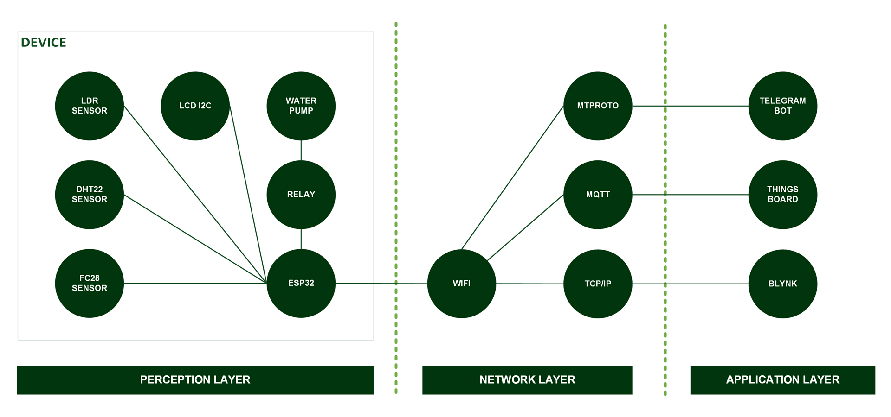

[](https://github.com/ellerbrock/open-source-badges/)
[](https://opensource.org/licenses/MIT)


# Smart Plant Care System (Echeveria Peacockii)
<strong>Tugas Akhir IoT Master Class Indobot 2022</strong><br><br>
Echeveria Peacockii merupakan jenis tanaman yang memiliki kekerabatan dengan kaktus, namun pada tubuh tanaman ini tidak dijumpai adanya duri, sehingga sangat diminati oleh para pecinta tanaman hias. Perawatan Echeveria Peacockii hingga saat ini masih dilakukan secara konvensional, sehingga boros waktu dan tenaga. Oleh karena itu, proyek ini dibuat untuk mendapatkan sistem yang mampu melakukan penyiraman sekaligus mampu memantau perubahan kondisi yang ada di lingkungan sekitar tanaman. Proyek ini telah dilaksanakan dan memakan waktu kurang lebih 1 bulan. Antarmuka sistem menggunakan Bot Telegram. Hasil penelitian menunjukkan bahwa sistem yang dibuat dapat berfungsi dengan baik.

<br><br>

## Kebutuhan Proyek
| Bagian | Deskripsi |
| --- | --- |
| Papan Pengembangan | DOIT ESP32 DEVKIT V1 |
| Editor Kode | Arduino IDE 1.8.19 (Versi Lama yang Stabil) |
| Dukungan Aplikasi | Bot Telegram |
| Driver | CP210X USB Driver |
| Platform IoT | • Blynk<br>• ThingsBoard |
| Protokol Komunikasi | • Inter Integrated Circuit (I2C)<br>• Message Queuing Telemetry Transport (MQTT)<br>• Transmission Control Protocol/Internet Protocol (TCP/IP)<br>• MTProto |
| Arsitektur IoT | 4 Lapisan |
| Bahasa Pemrograman | C/C++ |
| Pustaka Arduino | • WiFi (bawaan)<br>• BlynkSimpleEsp32 oleh Volodymyr Shymanskyy (Versi: 1.1.0)<br>• ThingsBoard oleh ThingsBoard Team (Versi: 0.9.0)<br>• PubSubClient oleh Nick O'Leary (Versi: 2.8)<br>• CTBot oleh Stefano Ledda (Versi: 2.1.11)<br>• ArduinoJson oleh Benoit Blanchon (Versi: 6.19.4)<br>• LiquidCrystal_I2C oleh Frank de Brabander (Versi: 1.1.2)<br>• DHT_sensor_library oleh Adafruit (Versi: 1.4.6)<br>• ESP_FC28 oleh cakraawijaya (Versi: 1.0.0) |
| Aktuator | Submersible pump (x2) |
| Sensor | • FC-28: Kelembaban Tanah Resistif (x1)<br>• LDR: Cahaya (x1)<br>• DHT22: Suhu & Kelembaban Udara (x1) |
| Layar | LCD I2C (x1) |
| Komponen Lainnya | • Kabel USB Mikro - USB tipe A (x1)<br>• Kabel jumper (1 set)<br>• Papan ekspansi ESP32 (x1)<br>• Breadboard (x1)<br>• Relay elektromekanis 2-channel (x1)<br>• Adaptor DC 5V (x1)<br>• Resistor (x2)<br>• Kotak casing (x1)<br>• Baut plus (1 set)<br>• Mur (1 set) |

<br><br>

## Unduh & Instal
1. Arduino IDE

   <table><tr><td width="810">

   ```
   https://bit.ly/ArduinoIDE_Installer
   ```

   </td></tr></table><br>

2. CP210X USB Driver

   <table><tr><td width="810">

   ```
   https://bit.ly/CP210X_USBdriver
   ```

   </td></tr></table>
   
<br><br>

## Rancangan Proyek
<table>
<tr>
<th width="840">Infrastruktur</th>
</tr>
<tr>
<td></td>
</tr>
</table>
<table>
<tr>
<th width="840">Diagram Ilustrasi</th>
</tr>
<tr>
<td></td>
</tr>
</table>
<table>
<tr>
<th colspan="2">Desain Perangkat Lunak</th>
</tr>
<tr>
<td width="420"></td>
<td width="420"></td>
</tr>
</table>
<table>
<tr>
<th width="840">Pengkabelan</th>
</tr>
<tr>
<td></td>
</tr>
</table>

<br><br>

## Memindai Alamat I2C Yang Ada Pada LCD
<table><tr><td width="840">

```ino
/*
  =====================================================
  I2C Scanner untuk Arduino / ESP32 / ESP8266
  by: Devan Cakra Mudra Wijaya, S.Kom.
  =====================================================

  Fungsi:
  - Mendeteksi seluruh perangkat I2C yang terhubung
  - Menampilkan alamat perangkat dalam format HEX
  - Menampilkan jumlah perangkat yang ditemukan


  =====================================================
  Pin SDA dan SCL untuk Arduino / ESP32 / ESP8266
  =====================================================
  Koneksi I2C Arduino (default):
  - Arduino Uno / Nano (ATmega328P)
    SDA -> A4
    SCL -> A5

  - Arduino Mega 2560
    SDA -> D20
    SCL -> D21

  - Board Arduino lainnya
    SDA -> Pin SDA
    SCL -> Pin SCL
    (Lihat datasheet atau pinout board)

  Koneksi I2C ESP32 (default):
  SDA -> GPIO 21
  SCL -> GPIO 22

  Koneksi I2C ESP8266 (default):
  SDA -> GPIO 4 (D2)
  SCL -> GPIO 5 (D1)
*/

// Memanggil library Wire untuk komunikasi I2C
#include <Wire.h>

// Konstanta untuk menentukan jeda antar scan (5000 ms = 5 detik)
const uint32_t SCAN_INTERVAL = 5000;


// Fungsi untuk menginisialisasi komunikasi I2C
// Konfigurasi pin SDA dan SCL akan disesuaikan secara otomatis berdasarkan jenis board yang digunakan
void initI2C() {

  // Jika board yang digunakan adalah ESP32, maka:
  #if defined(ESP32)

    // Mengaktifkan komunikasi I2C
    // SDA = GPIO21
    // SCL = GPIO22
    Wire.begin(21, 22);

  // Jika board yang digunakan adalah ESP8266, maka:
  #elif defined(ESP8266)

    // Mengaktifkan komunikasi I2C
    // SDA = D2 (GPIO4)
    // SCL = D1 (GPIO5)
    Wire.begin(D2, D1);

  // Jika board yang digunakan bukan ESP32 maupun ESP8266
  // Contoh: Arduino Uno, Nano, Mega, Leonardo, dll, maka:
  #else

    // Mengaktifkan komunikasi I2C menggunakan pin hardware bawaan board
    Wire.begin();

  #endif

}


// Fungsi setup() dijalankan satu kali saat board pertama kali menyala atau reset
// Digunakan untuk inisialisasi perangkat keras, komunikasi serial, sensor, modul, dan konfigurasi awal program
void setup() {

  // Memulai komunikasi Serial dengan baud rate 115200
  Serial.begin(115200);

  // Mengecek apakah board menggunakan USB native
  // Contoh: Arduino Leonardo, Arduino Micro, beberapa ESP32-S2/S3
  #if defined(USBCON) || defined(ARDUINO_USB_CDC_ON_BOOT)

    // Jika iya, maka:
    // Program akan menunggu sampai Serial Monitor terhubung sebelum melanjutkan eksekusi program
    while (!Serial);

  #endif

  // Menunggu selama 2 detik sebelum program dimulai
  delay(2000);

  // Menampilkan header program
  Serial.println("====================================");
  Serial.println("         I2C DEVICE SCANNER         ");
  Serial.println("by: Devan Cakra Mudra Wijaya, S.Kom.");
  Serial.println("====================================");

  // Mencetak baris kosong
  Serial.println();

  // Menginisialisasi komunikasi I2C
  initI2C();
}


// Fungsi loop() dijalankan terus-menerus setelah Fungsi setup() selesai
// Seluruh logika utama program biasanya ditempatkan di dalam fungsi ini
void loop() {

  // Variabel untuk menyimpan kode error hasil komunikasi I2C
  uint8_t error;

  // Variabel untuk menyimpan alamat I2C yang sedang diperiksa
  uint8_t address;

  // Variabel penghitung jumlah device yang ditemukan
  uint8_t deviceCount = 0;

  // Menampilkan informasi bahwa proses scan dimulai
  Serial.println("------------------------------------");
  Serial.println("Scanning I2C bus...");
  Serial.println("------------------------------------");

  // Melakukan perulangan dari alamat 1 sampai 126
  // Alamat I2C valid adalah 0x01 sampai 0x7E
  for (address = 1; address < 127; address++) {

    // Memulai komunikasi ke alamat yang sedang diuji
    Wire.beginTransmission(address);

    // Mengakhiri transmisi dan menyimpan hasilnya
    // 0 = sukses
    // 1 = data terlalu panjang
    // 2 = NACK saat alamat dikirim
    // 3 = NACK saat data dikirim
    // 4 = error lain
    error = Wire.endTransmission();

    // Jika tidak ada error, maka:
    if (error == 0) {

      // Menampilkan informasi device ditemukan
      Serial.print("[FOUND] Device at address 0x");

      // Jika alamat kurang dari 16, maka:
      // Tambahkan angka 0 di depan agar format HEX rapi
      if (address < 16) {
        Serial.print("0");
      }

      // Menampilkan alamat dalam format HEX
      Serial.println(address, HEX);

      // Menambah jumlah device yang ditemukan
      deviceCount++;
    }

    // Jika terjadi error tidak dikenal, maka:
    else if (error == 4) {

      // Menampilkan pesan error
      Serial.print("[ERROR] Unknown error at address 0x");

      // Jika alamat kurang dari 16, maka:
      // Tambahkan angka 0 di depan agar format HEX rapi
      if (address < 16) {
        Serial.print("0");
      }

      // Menampilkan alamat yang bermasalah dalam format HEX
      Serial.println(address, HEX);
    }

    // Jika error selain 0 atau 4, maka:
    // Diabaikan, biasanya ini terjadi karena tidak ada perangkat pada alamat tersebut
  }

  // Mencetak baris kosong
  Serial.println();

  // Jika tidak ada device ditemukan, maka:
  if (deviceCount == 0) {

    // Tampilkan pesan tidak ada device
    Serial.println("No I2C devices found.");
  }
  else { // Jika setidaknya satu perangkat ditemukan, maka:

    // Menampilkan jumlah device yang ditemukan
    Serial.print("Total devices found: ");

    // Menampilkan nilai deviceCount
    Serial.println(deviceCount);
  }

  // Menampilkan informasi waktu scan berikutnya
  Serial.print("Next scan in ");

  // Mengubah milidetik menjadi detik
  Serial.print(SCAN_INTERVAL / 1000);

  // Menampilkan satuan detik
  Serial.println(" seconds.");

  // Baris kosong
  Serial.println("\n");

  // Menunggu selama 5 detik sebelum scan ulang
  delay(SCAN_INTERVAL);
}
```

</td></tr></table><br><br>

## Pengaturan Arduino IDE
1. Buka ``` Arduino IDE ``` terlebih dahulu, kemudian buka proyek dengan cara klik ``` File ``` -> ``` Open ``` : 

   <table><tr><td width="810">
      
      ``` SistemPerawatanEcheveriaBlynkIoT.ino ``` atau ``` SistemPerawatanEcheveriaThingsboardIoT.ino ```
         
   </td></tr></table><br>
   
2. Isi ``` Url Pengelola Papan Tambahan ``` di Arduino IDE

   <table><tr><td width="810">

      Klik ``` File ``` -> ``` Preferences ``` -> masukkan ``` Boards Manager Url ``` dengan menyalin tautan berikut :
      
      ```
      https://dl.espressif.com/dl/package_esp32_index.json
      ```
         
   </td></tr></table><br>
   
3. ``` Pengaturan Board ``` di Arduino IDE

   <table>
      <tr><th width="810">

      Cara mengatur board ``` DOIT ESP32 DEVKIT V1 ```
            
      </th></tr>
      <tr><td width="810">
         
      • Cara: klik ``` Tools ``` -> ``` Board ``` -> ``` Boards Manager ``` -> Instal ``` esp32 ```.

      • Kemudian pilih papan dengan mengklik: ``` Tools ``` -> ``` Board ``` -> ``` ESP32 Arduino ``` -> ``` DOIT ESP32 DEVKIT V1 ```.

      </td></tr>
   </table><br>
   
4. ``` Ubah Kecepatan Papan ``` di Arduino IDE

   <table><tr><td width="810">

      Klik ``` Tools ``` -> ``` Upload Speed ``` -> ``` 115200 ```
         
   </td></tr></table><br>
   
5. ``` Instal Pustaka ``` di Arduino IDE

   <table><tr><td width="810">

      Unduh semua file zip pustaka. Kemudian tempelkan di: ``` C:\Users\Computer_Username\Documents\Arduino\libraries ```
         
   </td></tr></table><br>

6. ``` Pengaturan Port ``` di Arduino IDE

   <table><tr><td width="810">

      Klik ``` Port ``` -> Pilih sesuai dengan port perangkat anda ``` (anda dapat melihatnya di Device Manager) ```
         
   </td></tr></table><br>

7. Ubah ``` Nama WiFi ```, ``` Kata Sandi WiFi ```, dan sebagainya sesuai dengan apa yang anda gunakan saat ini.<br><br>

8. Sebelum mengunggah program, silakan klik: ``` Verify ```.<br><br>

9. Jika tidak ada kesalahan dalam kode program, silakan klik: ``` Upload ```.<br><br>
    
10. Beberapa hal yang perlu anda lakukan saat menggunakan ``` board ESP32 ``` :

    <table><tr><td width="810">
       
       • Jika ``` board ESP32 ``` tidak dapat memproses ``` Source Code ``` secara total -> Tekan tombol ``` EN (RST) ``` -> ``` Restart ```.

       • Jika ``` board ESP32 ``` tidak dapat memproses ``` Source Code ``` secara otomatis maka :<br>

      - Ketika informasi: ``` Uploading... ``` telah muncul -> segera tekan dan tahan tombol ``` BOOT ```.<br>

      - Ketika informasi: ``` Writing at .... (%) ``` telah muncul -> lepaskan tombol ``` BOOT ```.

       • Jika pesan: ``` Done Uploading ``` telah muncul -> ``` Program yang diisikan tadi sudah bisa dioperasikan ```.

       • Jangan tekan tombol ``` BOOT ``` dan ``` EN ``` secara bersamaan karena hal ini bisa beralih ke mode ``` Unggah Firmware ```.

    </td></tr></table><br>

11. Jika masih ada masalah saat unggah program, maka coba periksa pada bagian ``` driver ``` / ``` port ``` / ``` yang lainnya ```.

<br><br>

## Pengaturan Blynk
1. Memulai blynk :

   <table><tr><td width="810">
      
      • Buka situs resmi Blynk berikut: <a href="https://blynk.io">blynk.io</a>.
      
      • Klik ``` Start Free ``` untuk mendaftar.
      
      • Masukkan email.
      
      • Buka email untuk konfirmasi.
      
      • Masuk menggunakan akun yang sudah dibuat.

   </td></tr></table><br>   
   
2. Buat template baru :

   <table><tr><td width="810">
      
      • Klik ``` Developer Zone ``` -> lalu pilih opsi ``` My Templates ```.
   
      • Kemudian klik ``` + New Templates ``` untuk membuat Template Baru.
   
      • Bagian ``` NAME ``` diisi dengan ``` Smart Farming ```, ``` HARDWARE ``` pilih ``` ESP32 ```, ``` CONNECTION TYPE ``` pilih ``` WiFi ```, ``` TEMPLATE DESCRIPTION ``` bersifat opsional.
   
      • Klik ``` Done ```.

   </td></tr></table><br>
   
3. Buat datastreams :

   <table><tr><td width="810">
      
      • Masuk ke menu ``` Datastreams ``` -> klik ``` + New Datastreams ``` -> pilih ``` Virtual Pin ```.
      
      • Masukkan data pertama :
   
      - ``` NAME ``` -> ``` suhu_udara ```
      - ``` PIN ``` -> ``` V0 ```
      - ``` DATA TYPE ``` -> ``` Double ```
      - ``` UNITS ``` -> ``` Celcius, °C ```
      - ``` MIN ``` -> ``` 0 ```
      - ``` MAX ``` -> ``` 100 ```
      - ``` DECIMALS ``` -> ``` #.# ```
      - ``` DEFAULT VALUE ``` -> ``` 0 ```<br><br>
            
      • Masukkan data kedua :
   
      - ``` NAME ``` -> ``` kelembaban_udara ```
      - ``` PIN ``` -> ``` V1 ```
      - ``` DATA TYPE ``` -> ``` Integer ```
      - ``` UNITS ``` -> ``` Percentage, % ```
      - ``` MIN ``` -> ``` 0 ```
      - ``` MAX ``` -> ``` 100 ```
      - ``` DEFAULT VALUE ``` -> ``` 0 ```<br><br>
           
      • Masukkan data ketiga :
   
      - ``` NAME ``` -> ``` kelembaban_tanah ```
      - ``` PIN ``` -> ``` V2 ```
      - ``` DATA TYPE ``` -> ``` Integer ```
      - ``` UNITS ``` -> ``` Percentage, % ```
      - ``` MIN ``` -> ``` 0 ```
      - ``` MAX ``` -> ``` 100 ```
      - ``` DEFAULT VALUE ``` -> ``` 0 ```<br><br>
      
      • Masukkan data keempat :
   
      - ``` NAME ``` -> ``` cahaya ```
      - ``` PIN ``` -> ``` V3 ```
      - ``` DATA TYPE ``` -> ``` Integer ```
      - ``` UNITS ``` -> ``` Lux, lx ```
      - ``` MIN ``` -> ``` 0 ```
      - ``` MAX ``` -> ``` 100000 ```
      - ``` DEFAULT VALUE ``` -> ``` 0 ```<br><br>
             
      • Masukkan data kelima :
   
      - ``` NAME ``` -> ``` indikator_pompa1 ```
      - ``` PIN ``` -> ``` V4 ```
      - ``` DATA TYPE ``` -> ``` Integer ```
      - ``` MIN ``` -> ``` 0 ```
      - ``` MAX ``` -> ``` 1 ```
      - ``` DEFAULT VALUE ``` -> ``` 0 ```<br><br>
           
      • Masukkan data keenam :
   
      - ``` NAME ``` -> ``` indikator_pompa2 ```
      - ``` PIN ``` -> ``` V5 ```
      - ``` DATA TYPE ``` -> ``` Integer ```
      - ``` MIN ``` -> ``` 0 ```
      - ``` MAX ``` -> ``` 1 ```
      - ``` DEFAULT VALUE ``` -> ``` 0 ```<br><br>
      
      • Masukkan data ketujuh :
   
      - ``` NAME ``` -> ``` tombol_siram ```
      - ``` PIN ``` -> ``` V6 ```
      - ``` DATA TYPE ``` -> ``` Integer ```
      - ``` MIN ``` -> ``` 0 ```
      - ``` MAX ``` -> ``` 1 ```
      - ``` DEFAULT VALUE ``` -> ``` 0 ```<br><br>
      
      • Klik ``` Create ```.
      
      • Klik ``` Save ```.

   </td></tr></table><br>
   
4. Buat device baru :

   <table><tr><td width="810">
      
      • Masuk ke menu ``` Devices ```.
      
      • Klik ``` + New Devices ``` untuk menambahkan devices baru.
      
      • Pilih ``` From Templates ``` :
   
      - ``` TEMPLATE ``` -> ``` Smart Farming ```
      - ``` DEVICE NAME ``` -> ``` Smart Farming ```<br><br>
           
      • Klik ``` Create ```.

   </td></tr></table><br>
   
5. Kelola dashboard pada situs Blynk :

   <table><tr><td width="810">
      
      • Klik ``` simbol titik 3 ``` -> kemudian pilih ``` Edit Dashboard ```.
   
      • Pilih ``` widget yang diinginkan ``` lalu ``` drag ``` ke area dashboard.
   
      • Klik ``` setting ``` pada widget yang ditambahkan.
   
      • Pilih datastream yang sudah tersedia, antara lain: ``` suhu_udara ``` / ``` kelembaban_udara ``` / ``` kelembaban_tanah ``` / ``` cahaya ``` / ``` indikator_pompa1 ``` / ``` indikator_pompa2 ``` / ``` tombol_siram ```.
   
      • Klik ``` Save And Apply ```.

   </td></tr></table><br>

6. Kelola dashboard pada Blynk mobile apps :

   <table><tr><td width="810">
      
      • Buka ponsel pintar anda -> lalu di ``` Google Play Store ```, cari aplikasi yang bernama ``` Blynk IoT ``` -> kemudian ``` instal ```.
   
      • Buka aplikasi tersebut -> lalu lakukan konfigurasi seperti yang ada di situs Blynk tadi.
   
      • Selebihnya anda dapat mencari tutorial di ``` Google ``` untuk memperkaya wawasan anda.

   </td></tr></table><br>
   
7. Konfigurasi firmware :

   <table><tr><td width="810">
      
      • Masuk ke menu  ``` Devices ``` -> pilih ``` Smart Farming ``` -> klik ``` Device Info ```.
   
      • Salin ``` ID Template ```, ``` Nama Template ```, dan ``` AuthToken ``` tersebut.
   
      • Kemudian tempelkan pada bagian paling atas kode firmware, contohnya seperti ini :
   
      ```ino
      #define BLYNK_TEMPLATE_ID "TMPL6ZSHxYC-z"
      #define BLYNK_TEMPLATE_NAME "Smart Farming"
      #define BLYNK_AUTH_TOKEN "fw1oXlpe-YfYh7JXQHu4QTS3EqlnM-iw"
      ```

   </td></tr></table>
   
<br><br>

## Pengaturan ThingsBoard
1. Memulai ThingsBoard :

   <table><tr><td width="810">
      
      • Buka situs resmi ThingsBoard berikut: <a href="https://thingsboard.cloud/">thingsboard.cloud</a>.
      
      • Masuk dengan akun google.

   </td></tr></table><br>
   
2. Buat device profile baru :

   <table><tr><td width="810">
      
   • Masuk ke menu ``` Profiles ``` -> lalu pilih ``` Device profiles ```.

   •  Klik ``` + (Add device profile) ```.

   •  Device profile details: ``` Name ``` -> ``` MQTT ```.

   •  Transport configuration: ``` Transport type ``` -> ``` MQTT ```. Lalu isilah data MQTT seperti yang terlihat di bawah ini :

      <table><tr><td width="810">
      
      - Telemetry topic filter: ``` v1/devices/me/telemetry/fpiotdevan ```. Ini nanti harus sama dengan yang ada di kode firmware.
        
      - Attributes publish & subscribe topic filter: ``` v1/devices/me/attributes/fpiotdevan ```. Ini nanti harus sama dengan yang ada di kode firmware.
        
      - MQTT device payload : ``` JSON ```.

      </td></tr></table>

   •  Klik ``` Add ``` untuk menambahkan.

   </td></tr></table><br>
   
3. Buat device baru :

   <table><tr><td width="810">
      
      • Masuk ke menu ``` Entities ``` -> lalu pilih ``` Devices ``` -> ``` Groups ```.
   
      • Ubah akses device groups ``` All ``` menjadi ``` Public ``` agar dapat digunakan secara luas.
   
      • Buka device groups ``` All ```.
   
      • Klik ``` + (Add device) ```.
   
      • Buatlah 1 device dengan ketentuan sebagai berikut :

      <table><tr><td width="810">
      
      - ``` Name ``` -> ``` EcheveriaIoT ```
      - ``` Label ``` -> ``` EcheveriaIoT ```
      - ``` Device profile ``` -> ``` default ```
   
      </td></tr></table>

   </td></tr></table><br>
   
4. Buat dashboard :

   <table><tr><td width="810">
      
      • Masuk ke menu ``` Dashboards ``` -> ``` Groups ``` -> ``` All ```.
   
      • Ubah akses dashboard groups ``` All ``` menjadi ``` Public ``` agar dapat digunakan secara luas.
   
      • Buka dashboard groups ``` All ```.
   
      • Klik ``` + (Add dashboard) ```.
   
      • Lalu beri nama ``` Echeveria Dashboard ``` -> klik ``` Add ``` untuk menambahkan.
   
      • Ubah ``` title ``` menjadi ``` Sistem Perawatan Echeveria ```.
   
      • Pilih ``` widget yang diinginkan ``` -> pengaturan pada widget.

   </td></tr></table><br>
   
5. Konfigurasi firmware :

   <table><tr><td width="810">
      
      • Masuk ke menu ``` Entities ``` -> lalu pilih ``` Devices ``` -> ``` Groups ```.
   
      • Klik ``` EcheveriaIoT ``` -> salin ``` ID Device ``` dan ``` Token ``` tersebut.
   
      • Kemudian tempelkan pada kode firmware, contohnya seperti ini :
   
      ```ino
      #define DEVICE_ID_TB "26001630-a274-11ee-9db5-1fb69bbe078f"
      #define ACCESS_TOKEN_TB "tovosJJOLHzwc42DSfvM"
      ```

   </td></tr></table>

<br><br>

## Pengaturan Bot Telegram
1. Buka <a href="https://t.me/botfather">@BotFather</a>.<br><br>

2. Ketik ``` /newbot ```.<br><br>

3. Ketik nama bot yang diinginkan, contoh: ``` echeveria_bot ```.<br><br>

4. Ketik nama pengguna bot yang diinginkan, contoh: ``` echeveria_bot ```.<br><br>

5. Lakukan juga untuk pengaturan gambar bot, deskripsi bot, dan lain sebagainya menyesuaikan dengan kebutuhan anda.<br><br>

6. Salin ``` API token bot telegram anda ``` -> lalu tempelkan pada bagian ``` #define BOTtoken "YOUR_API_BOT_TOKEN" ```. 

   <table><tr><td width="810">
      
   Contohnya :

   ```ino
   #define BOTtoken "5911801402:AAFEEuBYHPmDxlYQxfPpTCZkRpn5d8hV_3E"
   ```
         
   </td></tr></table>

<br><br>

## Memulai
1. Unduh dan ekstrak repositori ini.<br><br>
   
2. Pastikan anda memiliki komponen elektronik yang diperlukan.<br><br>
   
3. Pastikan komponen anda telah dirancang sesuai dengan diagram.<br><br>
   
4. Konfigurasikan perangkat anda menurut pengaturan di atas.<br><br>

5. Selamat menikmati [Selesai].

<br><br>

## Sorotan
<table>
<tr>
<th width="840">Perangkat</th>
</tr>
<tr>
<td></td>
</tr>
</table>
<table>
<tr>
<th colspan="3">Antarmuka Bot Telegram</th>
<th colspan="1">Pemantauan melalui Blynk Mobile</th>
</tr>
<tr>
<td width="210"></td>
<td width="210"></td>
<td width="210"></td>
<td width="210"></td>
</tr>
</table>
<table>
<tr>
<th width="840">Pemantauan melalui Thingsboard</th>
</tr>
<tr>
<td></td>
</tr>
</table>

<br><br>

## Demonstrasi Aplikasi
Via Telegram: <a href="https://t.me/echeveria_bot">@echeveria_bot</a>

<br><br>

##  Catatan
<blockquote>
   Pada proyek ini, fungsi millis() telah diterapkan untuk meminimalkan pemblokiran kode dan meningkatkan efisiensi. Namun, untuk mendapatkan hasil yang jauh lebih optimal di masa depan, disarankan menggunakan RTOS (Real-Time Operating System) untuk mengelola prioritas tugas.
</blockquote>

<br><br>

## Apresiasi
Jika karya ini bermanfaat bagi anda, maka dukunglah karya ini sebagai bentuk apresiasi kepada penulis dengan mengklik tombol ``` ⭐Bintang ``` di bagian atas repositori.

<br><br>

## Penafian
Aplikasi ini merupakan hasil karya saya sendiri dan bukan merupakan hasil plagiat dari penelitian atau karya orang lain, kecuali yang berkaitan dengan layanan pihak ketiga yang meliputi: pustaka, kerangka kerja, dan lain sebagainya.

<br><br>

## LISENSI
LISENSI MIT - Hak Cipta © 2023 - Devan C. M. Wijaya, S.Kom

Dengan ini diberikan izin tanpa biaya kepada siapa pun yang mendapatkan salinan perangkat lunak ini dan file dokumentasi terkait perangkat lunak untuk menggunakannya tanpa batasan, termasuk namun tidak terbatas pada hak untuk menggunakan, menyalin, memodifikasi, menggabungkan, mempublikasikan, mendistribusikan, mensublisensikan, dan/atau menjual salinan Perangkat Lunak ini, dan mengizinkan orang yang menerima Perangkat Lunak ini untuk dilengkapi dengan persyaratan berikut:

Pemberitahuan hak cipta di atas dan pemberitahuan izin ini harus menyertai semua salinan atau bagian penting dari Perangkat Lunak.

DALAM HAL APAPUN, PENULIS ATAU PEMEGANG HAK CIPTA DI SINI TETAP MEMILIKI HAK KEPEMILIKAN PENUH. PERANGKAT LUNAK INI DISEDIAKAN SEBAGAIMANA ADANYA, TANPA JAMINAN APAPUN, BAIK TERSURAT MAUPUN TERSIRAT, OLEH KARENA ITU JIKA TERJADI KERUSAKAN, KEHILANGAN, ATAU LAINNYA YANG TIMBUL DARI PENGGUNAAN ATAU URUSAN LAIN DALAM PERANGKAT LUNAK INI, PENULIS ATAU PEMEGANG HAK CIPTA TIDAK BERTANGGUNG JAWAB, KARENA PENGGUNAAN PERANGKAT LUNAK INI TIDAK DIPAKSAKAN SAMA SEKALI, SEHINGGA RISIKO ADALAH MILIK ANDA SENDIRI.
